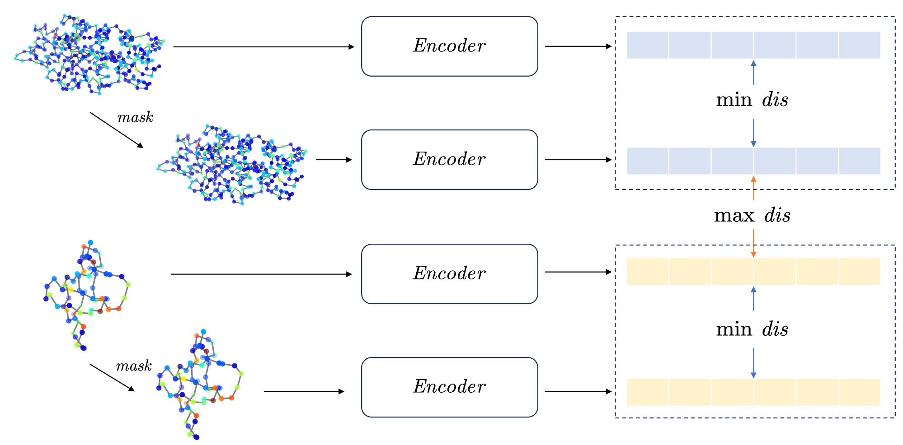
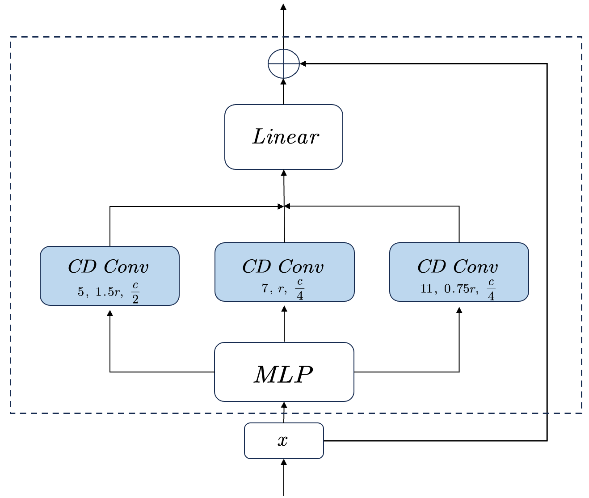
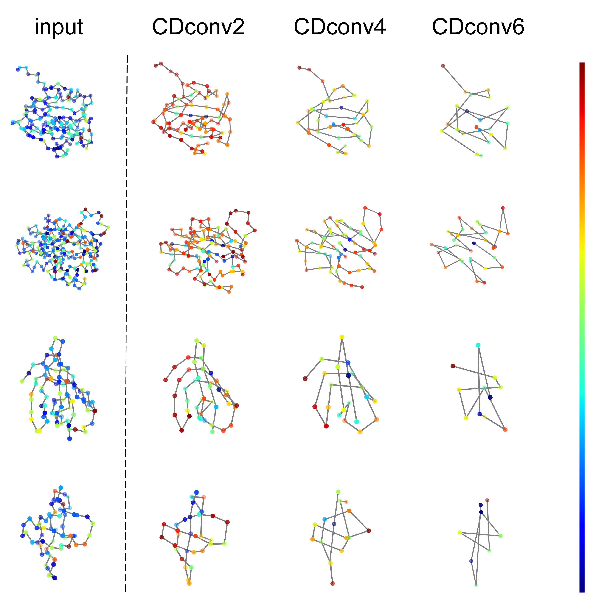

# Continuous-Discrete Convolutional Network Optimization Based on Pre-Training

This project is based on the use of [continuous-discrete convolutional networks](https://github.com/hehefan/Continuous-Discrete-Convolution) to predict proteins, and tries to improve the performance of the model with a variety of methods based on pre-training.

First, we use the EC data set to pre-train the protein structure classification task through comparative learning, expecting to improve the effect of the neural network on the protein structure classification on the fold data set. Specifically, in the experiment, we randomly deleted 10% of the amino acids from the original protein in the EC and formed a positive and negative data pair with the original protein, used CDconv to perform pre-training encoding, and then extracted the encoding information through MLP, but did not perform classification tasks , iteratively updates the network parameters by minimizing the encoded information difference between positive and negative data pairs. The parameters trained on the EC protein dataset are used to initialize the parameters of the classification task of the fold dataset.



Second, we try to improve the framework of the model by running CDconv with different scales in parallel to flexibly adjust the discrete convolution kernel coverage when understanding protein amino acid sequences. Specifically, for the Basic Block in the code implementation of the original paper, we changed the CDconv module with l=5 into three parallel CDconv modules with l=5, 7, and 11, and renamed the whole module as Branch Block. Experiments show that this improvement can achieve a large improvement at the beginning of the iteration, but with the training of the neural network, the final effect is gradually similar to the original network. This shows that the size of the discrete convolution kernel coverage based on the protein sequence order is not highly related to the final encoding effect of the neural network.



Finally, we verified the conclusion in the paper through experiments—the deep learning neural network's understanding of protein structure is mainly based on the central amino acid. We guess that this conclusion may be related to the fact that the aggregation function of the message passing in the graph neural network in the code implementation of the paper is set to sum. The sum will lead to a larger feature encoding value of the amino acid with a large number of points around it, and the central amino acid. The number of amino acid points is generally more than the number of amino acid points around the edge point, which will make the feature code value of the center point larger than the feature code value of the edge point, that is, the activation value is higher, causing the neural network to understand the protein mainly based on the central amino acid of the protein The phenomenon. We set the aggregation function here to mean and then retrain the network and draw the activation value image to explore the influence of artificially setting the aggregation function on the neural network's understanding of proteins.



## Installation

The code is tested with Ubuntu 20.04.5 LTS, CUDA v11.7, cuDNN v8.5, PyTorch 1.13.1, PyTorch Geometric (PyG), PyTorch Scatter and PyTorch Sparse.

Install PyTorch 1.13.1:

```
conda install pytorch==1.13.1 torchvision==0.14.1 torchaudio==0.13.1 pytorch-cuda=11.7 -c pytorch -c nvidia
```

Install PyG & Pytorch-cluster :

```
conda install pyg -c pyg
conda install pytorch-cluster -c pyg
```

Install PyTorch Scatter and PyTorch Sparse:

```
pip install torch_scatter torch_sparse -f https://data.pyg.org/whl/torch-1.13.1+cu117.html
```

## Run

The commands below are based on you being in the scripts directory.

Pre-train:

```
python pre_train.py
```

Train:
```
python train.py
```

Inference:
```
python inference.py
```

## Datasets

We provide the pre-processed datasets for pretraining , training and evaluating protein representation learning:

1. [Protein Fold](https://drive.google.com/file/d/1vEdezR5L44swsw09WFnaA5zFuA1ZEXHI/view?usp=sharing) &emsp; 2. [Enzyme Commission Number](https://drive.google.com/file/d/1VEIyBSJbRf9x6k_w4Tqy5SC0G6NWWSWl/view?usp=sharing)
